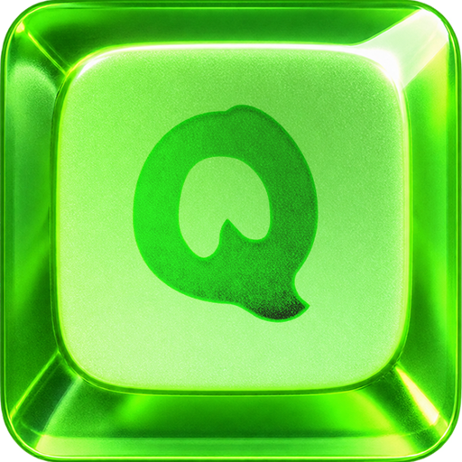
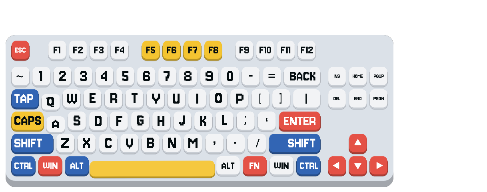
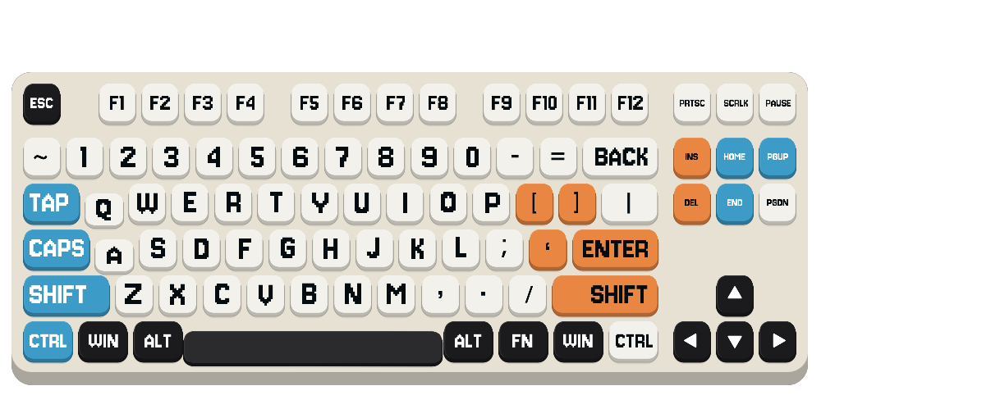
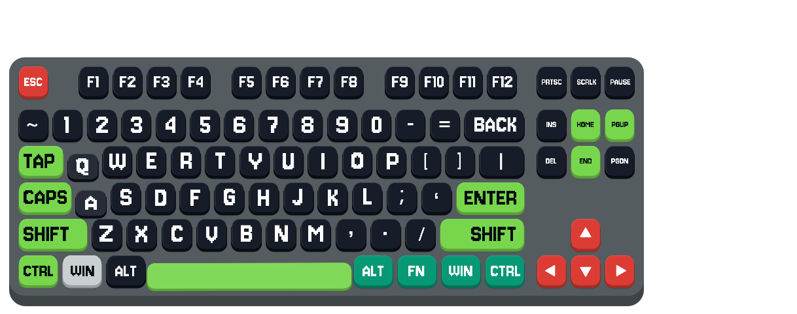
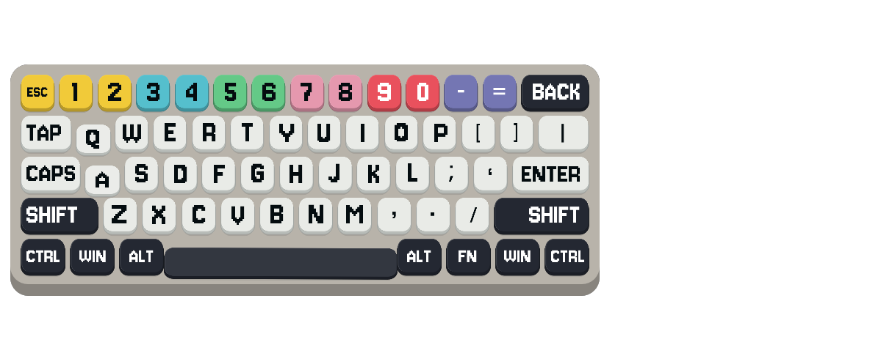

  

<h1 align="center">果冻键显 JellyKeys</h1>

直播与录屏的透明键盘按键可视化工具 Transparent keyboard visualizer for streaming and recording

<a href="#zh-cn">简体中文</a> · <a href="#english">English</a>

| 机甲晨光 / Mecha Dawn · 84 键 | 橙蓝实验室 / Portal Lab · 87 键 |
| :---: | :---: |
|  |  |
| 霓虹竞技场 / Neon Arena · 87 键 | 虹彩银翼 / Spectrum Silver · 61 键 |
|  |  |

## 简体中文

JellyKeys 使用 Godot 4.7.1 .NET 开发。真实键盘按下时，透明覆盖层上的对应键帽会下沉、回弹。可以调整键盘位置、大小、配色和文字贴图，适合直播与录屏。

### 下载与运行

从 Releases 下载 Windows x64 安装包或绿色版。绿色版解压后运行 <code>JellyKeys.exe</code>，并保持 <code>data_JellyKeyboardOverlay_windows_x86_64</code> 文件夹与 EXE 放在一起。无需单独安装 .NET 运行时。

首次启动默认锁定位置，只显示键盘，鼠标点击可以穿透覆盖层。鼠标移到键盘上方时，键盘会平滑淡化。

### 解锁、调整和重新锁定

1. 按 <code>Ctrl + Shift + F10</code> 唤醒 Bar 条，或右键托盘图标选择“打开 Bar 条”。
2. 点击 Bar 条的锁图标，使它处于**未选中**状态，然后按 **OK**。锁图标选择退出后的状态；按 OK 才会保存并生效。
3. 拖动键盘底座调整位置，在底座或 Bar 条上滚动滚轮调整大小，范围为 25%–150%。
4. 调整完成后再次打开 Bar 条，**选中**锁图标并按 **OK**，恢复鼠标穿透。

Bar 条可以切换主题、调整缩放和打开设置。设置面板支持编辑键帽与底板配色、管理主题、导入文字贴图，以及选择实体键盘布局。布局可跟随主题、自动识别或手动选择；自动识别不准确时可手动指定。托盘菜单可以切换“自启动”。

### 主题文件

主题导出为单个 <code>.jellytheme</code> 文件，包含 <code>theme.json</code> 和 <code>text.png</code>。导入主题或单独导入自制文字贴图时，程序会检查格式与贴图尺寸。字段和限制见[主题包格式](THEME_PACKAGE_FORMAT.md)。

内置主题随程序提供；新建、导入或修改后保存的主题位于本机 <code>user://themes/user/</code>，当前状态位于 <code>user://state/</code>。更换主题不会覆盖单独选择的实体键盘布局。

### 从源码运行与打包

需要 Windows x64、Godot **4.7.1 .NET** 和 .NET **8 SDK**。用 Godot 打开 <code>project.godot</code>，编译 C# 后运行主场景；也可以在项目目录执行：

~~~powershell
dotnet restore ./JellyKeyboardOverlay.sln
dotnet build ./JellyKeyboardOverlay.sln -c Release
~~~

Windows 导出预设位于 <code>export_presets.cfg</code>。安装与 Godot 4.7.1 对应的 .NET 导出模板后，在编辑器中选择 **Project → Export → Windows Desktop**。发行包的 C# 程序集经过兼容 Godot 的混淆处理，仓库源码保持可读。

安装脚本位于 <code>packaging/windows/JellyKeys.iss</code>，使用 Inno Setup 6 编译。Godot 资源的 <code>.uid</code> 和 <code>.import</code> 文件需要随源码保留；<code>builds/</code> 已被 Git 忽略。

### 隐私

程序只读取按键的按下、松开事件以驱动动画，不记录按键序列，也不上传输入内容。配置和用户主题保存在本机。只有主动开启托盘“自启动”时，程序才会写入当前 Windows 用户的启动项。

### 贡献与许可

欢迎提交 Issue。贡献代码时，请 Fork 仓库、创建分支、提交 Pull Request，并说明修改原因和验证方式；界面改动请附截图。完整流程见[贡献指南](CONTRIBUTING.md)。

Copyright (C) 2026 **米夏小雨**。项目源码、原创图标和主题预览图按 **GNU GPL 3.0（仅此版本）** 授权，完整英文条款见 [LICENSE](LICENSE)。分发基于本项目的受许可作品或二进制版本时，须按许可证向接收者提供对应源码；发布安装包或绿色版时，请同时提供同版本源码包。第三方组件遵循各自许可证。

## English

JellyKeys is a transparent keyboard overlay for Windows streaming and recording, built with Godot 4.7.1 .NET. Physical key presses animate the matching keycaps. You can move and scale the overlay, change colors, and customize the key-label texture.

### Download and run

Download the Windows x64 installer or portable archive from Releases. For the portable edition, extract the whole archive and run <code>JellyKeys.exe</code>. Keep the <code>data_JellyKeyboardOverlay_windows_x86_64</code> folder beside the EXE. No separate .NET runtime installation is needed.

The keyboard starts locked: only the overlay is visible, and mouse clicks pass through it. The keyboard fades smoothly when the pointer moves over it.

### Unlock, adjust, and lock again

1. Press <code>Ctrl + Shift + F10</code> to show the Bar, or right-click the tray icon and choose “打开 Bar 条” (Open Bar).
2. Click the lock icon so it is **not selected**, then press **OK**. The icon selects the state to apply when the Bar closes; OK saves and applies it.
3. Drag the keyboard deck to move it. Scroll over the deck or Bar to scale it between 25% and 150%.
4. Reopen the Bar, **select** the lock icon, and press **OK** to restore mouse click-through.

The Bar also switches themes, changes scale, and opens Settings. Settings can edit keycap and deck colors, manage themes, import a key-label texture, and choose the physical keyboard layout. Layout detection can follow the theme, run automatically, or be set manually. The tray menu also controls startup with Windows (“自启动”).

### Themes

A theme exports as one <code>.jellytheme</code> file containing <code>theme.json</code> and <code>text.png</code>. Imports validate the package format and image dimensions, including when you import an edited label texture on its own. See the [theme package specification](THEME_PACKAGE_FORMAT.md) for fields and limits.

Built-in themes ship with the app. New, imported, and edited themes are stored locally under <code>user://themes/user/</code>; current state is stored under <code>user://state/</code>. Switching themes does not override a separately selected physical keyboard layout.

### Build from source

You need Windows x64, **Godot 4.7.1 .NET**, and the **.NET 8 SDK**. Open <code>project.godot</code> in Godot, build the C# project, and run the main scene. You can also build from the project directory:

~~~powershell
dotnet restore ./JellyKeyboardOverlay.sln
dotnet build ./JellyKeyboardOverlay.sln -c Release
~~~

The Windows export preset is in <code>export_presets.cfg</code>. Install the .NET export templates matching Godot 4.7.1, then use **Project → Export → Windows Desktop**. Release C# assemblies are obfuscated in a way compatible with Godot; repository source stays readable.

The Inno Setup 6 installer script is <code>packaging/windows/JellyKeys.iss</code>. Keep Godot <code>.uid</code> and <code>.import</code> files with the source. Git ignores <code>builds/</code>.

### Privacy

The app reads key-down and key-up events only to animate the overlay. It does not record key sequences or upload input. Settings and user themes stay on the local machine. A per-user Windows startup entry is created only if you enable “自启动” in the tray menu.

### Contributing and license

Issues and Pull Requests are welcome. To contribute, fork the repository, create a focused branch, and open a Pull Request explaining the change and how you tested it. Include before-and-after screenshots for UI changes. See [CONTRIBUTING.md](CONTRIBUTING.md) for details.

Copyright (C) 2026 **米夏小雨**. Source code, original icons, and theme preview images are licensed under **GNU GPL 3.0 only**; the full English terms are in [LICENSE](LICENSE). When distributing a covered derivative or binary, provide the corresponding source to recipients under the license. Publish the matching source archive alongside an installer or portable release. Third-party components retain their own licenses.